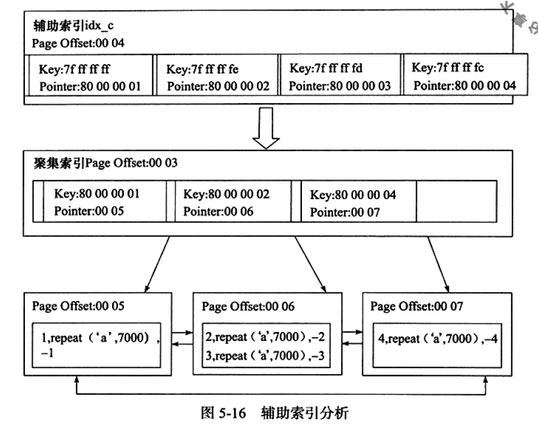

# 索引 

1. B+树索引  

   * 聚集索引  

     按照每张表的主键构造的一棵B+树，叶子节点存放行记录数据。
     
     非数据页节点（页高度不为0的），只存放键值（如主键），以及指向数据页的偏移量：
     
     
     
   * 辅助索引
   
     遍历辅助索引获得指向主键索引的主键，再通过主键索引即聚集索引来找到完整的行记录。也就是说，辅助索引是有回表的操作的。
   
     
   
     PS : Myisam是堆组织表，堆组织表存储数据是无序的，在扫全表数据时不会按照插入顺序来展示，因为他的插入底层原理就是最先找到能插入一行记录的物理地址就直接插入，与索引无关。而InnoDB是索引组织表，也就是索引即数据。也就是说，数据会按照主键顺序进行排序存储。
   
   1. B+树索引的分裂
   
      