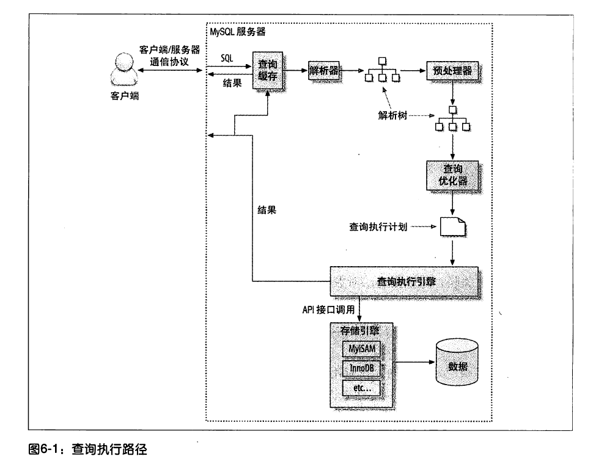

1. mysql对where条件的应用

   * 在索引中使用where条件过滤不匹配的记录（在存储引擎层完成）；
   * 使用索引覆盖扫描（在extra列出现using index）来返回记录，直接从索引中过滤不需要的记录并返回命中的结果（在mysql服务器层完成），无需回表；
   * 从数据表中返回数据，然后过滤不满足条件的记录（在extra列中出现using where）。（服务器层完成），需先读出记录再过滤；

2. mysql查询执行路径

   

3. 

